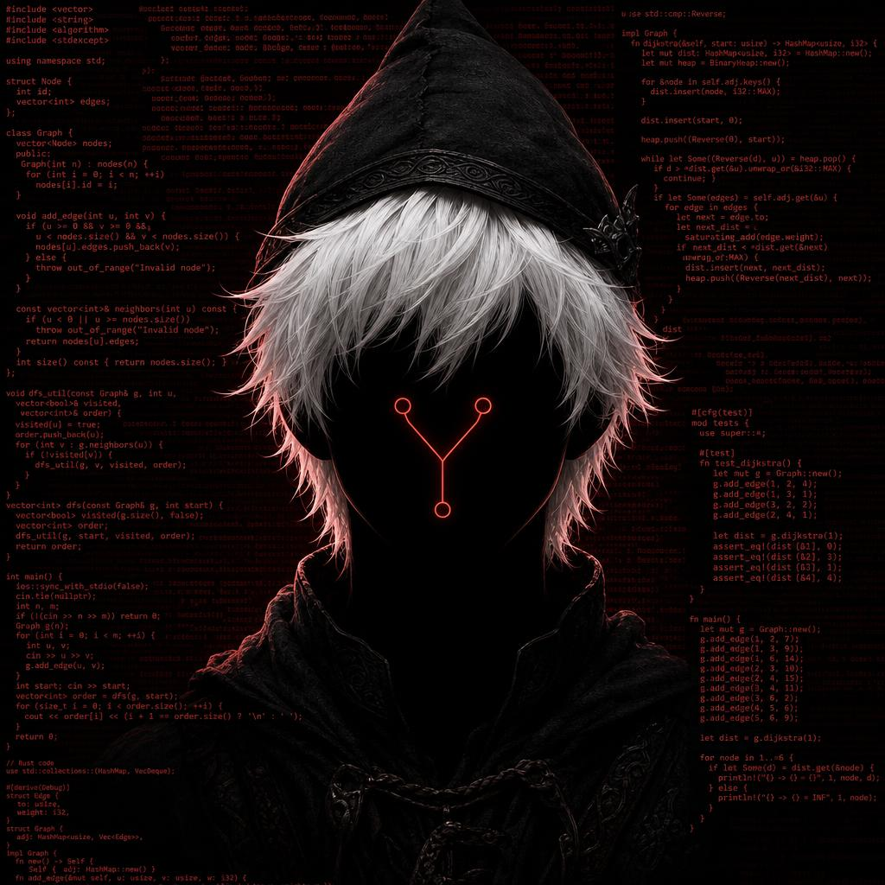

<!-- BANNER SUPERIOR: Estilo 'rect' (Recto, minimalista e industrial) -->

 

  <!-- Titular estilo Venom con contorno rojo -->
  

 

<!-- Animación de consola/terminal -->

  

#

 

<!-- PRESENTACIÓN CON ELEMENTO VISUAL A LA DERECHA -->
<table>
  <tr>
    <td width="60%" valign="top">
      

        Hello! I am an independent developer deeply passionate about <b>Open-Source Software (FOSS)</b> and <b>digital privacy</b>. I believe code should be transparent, fully auditable, and respectful of individual sovereignty.
          
        My work revolves around building tools that prioritize user privacy, zero-telemetry architecture, and data control. I focus on clean, efficient code and creating decentralized or self-hosted alternatives to mainstream proprietary software.
          
        If you value digital rights, code transparency, and privacy-first engineering, feel free to check out my repositories, contribute, or open a pull request.
      

    </td>
    <td width="40%" align="center" valign="middle">
      <!-- Elemento visual temático: GIF de consola/hacker en tono oscuro -->
      
    </td>
  </tr>
</table>

#

 

  
🛡️ <i>Building secure, privacy-first & open-source solutions</i> 🔐
  

 

<!-- SECCIÓN DE ESTADÍSTICAS REPARADAS (Usando GitHub Profile Summary Cards) -->

  
  

 

  <!-- Racha de Días Programando (Servidor Alternativo) -->
  

#

 

<!-- BADGES DE TECNOLOGÍAS -->

  
<b>Core Stack & Tools</b>

  
  
  
  
  
  
  
  
  
  

#

 

<!-- PRINCIPIOS / ENFOQUE -->

  
🚀 <b>Current Focus & Principles</b> ⚡

 

   
   
   
  

 
 

<!-- FOOTER BORDER: Estilo Rect / Slice -->

